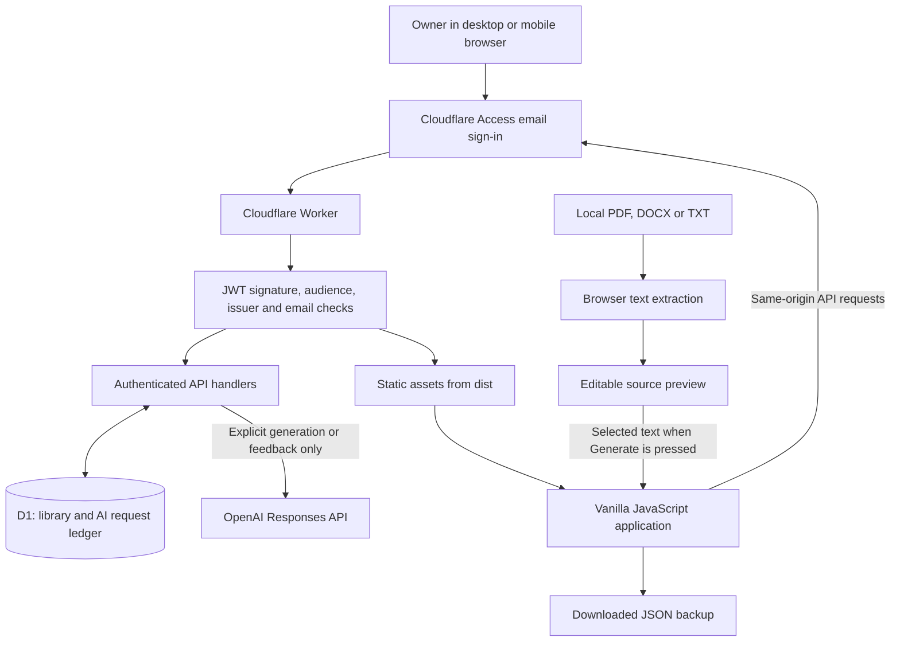
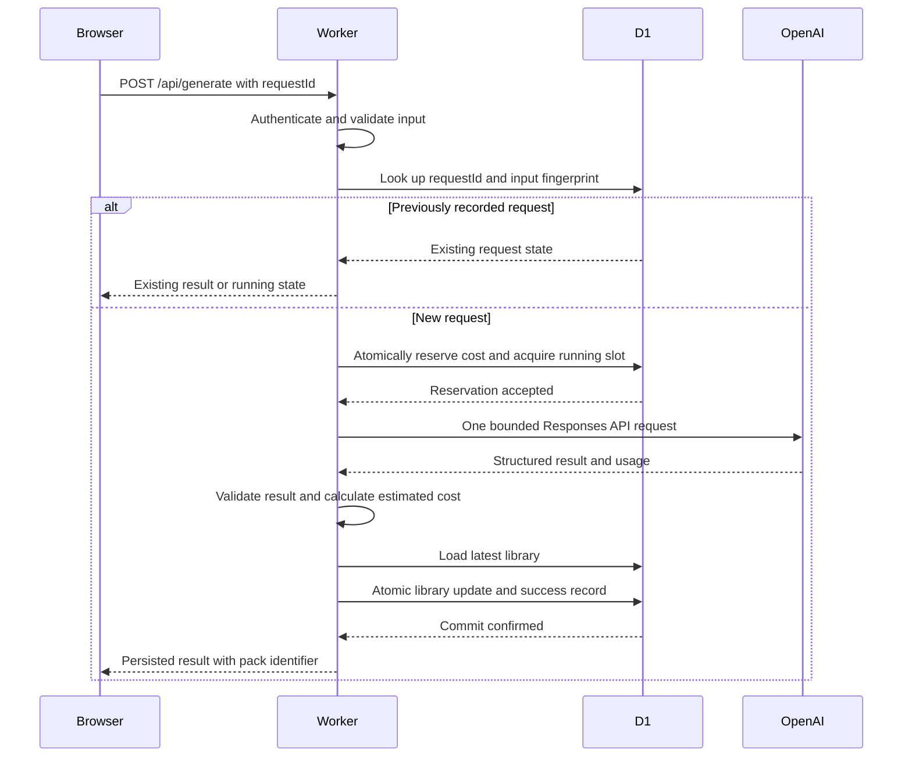

# Learning Lab — Project Documentation

**Documentation baseline:** 16 September 2026  
**Application:** https://learning-lab.ridokundanetshi.workers.dev  
**Scope:** the implemented hosted application, its retained local predecessor, and the operational workflow.

This document describes the code in this repository, rather than treating every item in the original plan as an independently verified production guarantee. The owner has confirmed that the deployed app and generation work. Automated verification, owner confirmation, and outstanding production checks are distinguished below.

## Contents

1. [Purpose and scope](#1-purpose-and-scope)
2. [System architecture](#2-system-architecture)
3. [Technology stack and tools](#3-technology-stack-and-tools)
4. [Application functionality](#4-application-functionality)
5. [Data model and persistence](#5-data-model-and-persistence)
6. [HTTP API](#6-http-api)
7. [Generation and cost control](#7-generation-and-cost-control)
8. [Scheduling and study progress](#8-scheduling-and-study-progress)
9. [Document processing](#9-document-processing)
10. [Security and privacy](#10-security-and-privacy)
11. [Backups and legacy migration](#11-backups-and-legacy-migration)
12. [Repository map](#12-repository-map)
13. [Local development](#13-local-development)
14. [Deployment and operations](#14-deployment-and-operations)
15. [Testing and verification](#15-testing-and-verification)
16. [Limitations and future work](#16-limitations-and-future-work)
17. [Troubleshooting](#17-troubleshooting)
18. [Maintenance guide](#18-maintenance-guide)

## 1. Purpose and scope

Learning Lab is a personal learning library. It turns a topic or selected source text into reusable flashcards, multiple-choice quizzes, lessons, and written recall exercises. Material and progress are saved centrally so they can be reopened in an authenticated browser on another device.

The central product rule is **explicit generation**: OpenAI is called only when the user requests a new study pack or feedback on a saved recall answer. Reading, searching, reviewing, scoring quizzes, editing cards, and backing up the library do not call OpenAI. These activities still use network requests and Cloudflare resources; “free study” means no AI-generation charge, not offline operation.

The current version is designed for one owner, an English interface, text-based source documents, and online synchronization. It is not a multi-user learning management system. There is no tutor chat, OCR, original-file storage, offline synchronization, or automatic daily content generation.

Two applications coexist in the repository:

| Application | Purpose | Persistence | Runtime |
| --- | --- | --- | --- |
| Hosted Learning Lab | Primary library and all learning formats | Cloudflare D1 | Browser plus Cloudflare Worker |
| Legacy local quiz | Preserve the original quiz and export existing browser progress | Browser localStorage | Standalone HTML or local Node server |

The original bank contains 120 questions across 15 topics, arranged into six groups of 20. A fresh hosted library includes this bank automatically.

## 2. System architecture

### 2.1 Component overview



Cloudflare Access gates the hostname. The Worker additionally verifies the Access token before serving either static files or API responses. `assets.run_worker_first: true` makes the Worker authentication boundary apply to bundled JavaScript and other assets as well as HTML.

The browser is a vanilla JavaScript single-page application with hash-based navigation. It loads the library into memory, renders screens, tracks unsaved changes, and sends mutations to the Worker. The application uses D1 directly through its Worker binding; there is no separate Express service, ORM, vector database, or file-storage service in the hosted runtime.

### 2.2 Responsibilities by layer

| Layer | Responsibilities | Main source |
| --- | --- | --- |
| Browser presentation | Navigation, forms, study interactions, progress status, backup downloads | `web/app.js`, `web/style.css` |
| Browser API adapter | JSON requests, login/network failure messages, escaped display text | `web/api.js` |
| Document extraction | Local PDF/DOCX/TXT parsing and preview text | `web/documents.js` |
| Shared domain logic | Validation, starter library, FSRS, migration, mixed-practice selection | `shared/model.js` |
| Shared generation contract | Model payload, structured-output schema, reservation estimate | `shared/generation.js` |
| Worker application | Authorization, routing, revisions, D1 transactions, budget ledger | `worker/index.js` |
| Provider adapter | OpenAI request, bounded response reading, output validation, usage cost | `worker/ai.js` |
| Persistent storage | Current library snapshot and request accounting | `migrations/0001_library.sql` |

### 2.3 Generation sequence



Budget rejection stops before the provider call. Provider or validation failures update the request ledger. Database failure cannot be reported as successful generation. An interrupted execution can leave a request in `running`; recovery is explicit, as described in section 7.

## 3. Technology stack and tools

Versions below are the versions resolved in `package-lock.json` at this documentation baseline. `package.json` allows compatible updates, so use `npm ci` for reproducible installs.

| Technology/tool | Version or configuration | Role |
| --- | --- | --- |
| JavaScript | ES modules for hosted code; CommonJS `.cjs` for legacy files | Application implementation |
| HTML and CSS | Native browser technologies | Responsive interface and accessible form/status elements |
| Node.js | 24 or newer | Build scripts, local server, tests, Wrangler CLI |
| npm | Lockfile-based installation | Dependency and script management |
| Vite | 7.3.6 | Browser module bundling, asset processing, lazy parser chunks |
| Cloudflare Workers | Compatibility date `2026-09-01` | API execution and static asset delivery |
| Cloudflare D1 | SQLite-compatible service | Library and AI accounting persistence |
| Cloudflare Access | Owner email login | Private access to the production hostname |
| Wrangler | 4.132.0 | Local Worker runtime, D1 migrations, deployment, secret management |
| OpenAI Responses API | `gpt-5-nano` | User-triggered educational content and recall feedback |
| Zod | 4.6.5 | Runtime input, output, and library validation |
| jose | 6.2.12 | Access JWT signature and claim verification using remote JWKS |
| ts-fsrs | 5.4.2 | Flashcard spaced-repetition scheduling |
| PDF.js / pdfjs-dist | 6.3.289 | Text extraction from PDF pages in the browser |
| Mammoth | 1.12.3 | DOCX raw-text extraction in the browser |
| Playwright | 1.63.0 | Browser workflow and document tests |
| Microsoft Edge | Installed `msedge` channel | Configured browser-test target |
| Node test runner and assertions | Built in | Unit, integration, and legacy API tests |
| Node SQLite | Built in | Real transaction behavior behind the D1 test adapter |
| Prettier | 3.9.7 | Source formatting |
| Git | Repository tooling | Version tracking and change inspection |

The Worker calls OpenAI using native `fetch`; the hosted project does not depend on an OpenAI SDK. It uses Web Crypto for SHA-256 fingerprints and UUID generation. No frontend framework is required.

Cloudflare Workers Free, D1 Free, and free Access are the intended hosting configuration. OpenAI API usage is the planned variable expense. The application does not select or upgrade Cloudflare billing plans; those remain account-level operational settings.

## 4. Application functionality

### 4.1 Home and navigation

The Home screen shows the most recently opened pack, a count of due flashcards, the active pack count, and up to four recent packs. Opening a pack records `lastPack` and updates its timestamp. “Recently studied” therefore reflects application activity timestamps rather than a separate analytics system.

Navigation routes are `#home`, `#library`, `#create`, `#pack/<id>`, `#practice`, and `#settings`. Format and position are retained where the pack's `cursor` is updated. Sign-out uses Cloudflare's `/cdn-cgi/access/logout` route.

### 4.2 Create study packs

The user supplies a topic, optional notes or extracted document text, a difficulty, and one or more formats. Difficulties are `beginner`, `intermediate`, and `advanced`.

| Selected format | Generated quantity | Content |
| --- | --- | --- |
| Flashcards | 20 | Front/question and back/answer |
| Quiz | 20 | Four choices, one correct index, topic, explanation |
| Lesson | One | Plain-text explanation, requested worked examples and misconceptions |
| Recall | Five | Prompt and example answer |

Only selected formats are requested. Regeneration opens a prefilled creation form and saves a new pack with a new identifier. It does not replace the original. The form displays a conservative maximum cost reservation before submission.

An empty pack can be created for manual cards without AI. This path uses the entered title/topic; it does not import the preview text or generate the selected formats.

### 4.3 Library management

Library search matches title and topic, case-insensitively. Format filters show packs containing that format. The archived checkbox switches between active and archived packs. Packs can be renamed, archived, and restored from the archive.

Archiving changes visibility. It does not delete data or release storage. The interface does not currently provide a permanent pack deletion workflow.

### 4.4 Flashcards

Scheduled study displays cards whose due date has arrived. The user reveals the answer before choosing Again, Hard, Good, or Easy. The Worker computes and saves the next FSRS schedule.

Free practice presents saved cards without altering schedules or recording scheduled reviews. Manual creation and editing require no AI. Editing a card preserves its existing review history and schedule; it does not reset learning progress.

### 4.5 Quizzes

Answers save as choices are selected. Submission calculates the number correct, records an attempt, and shows correct answers and explanations. Submitted questions are locked in the normal quiz view. A new attempt resets the current answer state while retaining attempt history.

The original quiz uses six groups. Generated quizzes use one group of 20. Missed-question practice uses the latest attempt and a separate `practiceDraft`, preserving the normal quiz draft and locked answers. Scores are for personal practice: the authenticated browser receives correct answers and computes attempt scores, so this is not a tamper-resistant examination system.

### 4.6 Lessons and recall

Lessons display saved plain text; they do not invoke the provider when opened.

Recall exercises encourage an answer before the example is revealed. Draft typing is saved after a 600 ms debounce. Submitting saves a dated answer and then reveals the example. Self-assessment uses Again, Hard, Good, or Easy and is free; these ratings do not invoke FSRS or create a recall schedule.

AI feedback is an explicit action on an already saved answer. The Worker reads that answer from D1, submits the exercise prompt, example answer, and written answer to OpenAI, and saves feedback alongside the answer. Feedback generation uses the same serialization and budget controls as pack generation.

### 4.7 Mixed practice

Mixed practice selects up to 20 due cards, ten missed quiz questions, and five recall exercises from active packs, in that order. Missed questions come from each pack's latest attempt. Within each category the implementation follows library order; it does not rank every card by lateness or difficulty.

The session finishes when the queue ends or when the 30-minute duration is checked at the next activity transition. It is not a countdown that interrupts an answer at exactly 30 minutes. The queue and timer are held in the current tab; completed reviews, answers, and attempts are saved normally.

### 4.8 Settings and backups

Settings expose the monthly app budget, timezone, current-month used/reserved cost, request history, library reload, JSON export, and JSON restore. Defaults are US $5 and `Africa/Johannesburg`. The budget can be set between $0 and $1,000. A zero budget blocks new AI calls while saved study material remains usable.

## 5. Data model and persistence

### 5.1 Physical database schema

D1 contains two tables, not a separate table for each learning format.

| Table/column | Type | Meaning |
| --- | --- | --- |
| `library.id` | INTEGER primary key, constrained to 1 | Single-owner library row |
| `library.revision` | INTEGER | Optimistic concurrency version, initially 0 |
| `library.data` | TEXT | Serialized version-2 library JSON |
| `ai_requests.id` | TEXT primary key | Generation/feedback request identifier |
| `ai_requests.fingerprint` | TEXT | SHA-256 digest of input and relevant context |
| `ai_requests.month` | TEXT | Budget month in `YYYY-MM` form |
| `ai_requests.status` | TEXT | `running`, `succeeded`, `failed`, `uncertain`, or `restored` |
| `ai_requests.reserved` | REAL | Estimated maximum request cost in USD |
| `ai_requests.cost` | REAL, nullable | Usage-based estimate when usage is available |
| `ai_requests.result` | TEXT, nullable | JSON containing pack ID, usage, and estimated cost |
| `ai_requests.error` | TEXT, nullable | Failure/recovery description |
| `ai_requests.created_at` / `finished_at` | TEXT | ISO timestamps |

The `ai_month` index supports month-based accounting. The `one_ai_request` unique partial index permits only one row with `status='running'` across the entire app. There are no per-user rows or foreign-key relationships between individual cards and SQL tables: those relationships live inside the library JSON.

### 5.2 Logical library structure

```text
Library version 2
  settings: monthlyBudget, timezone
  lastPack: pack ID or null
  packs[]
    identity: id, title, topic, difficulty
    lifecycle: createdAt, updatedAt, archived
    source: filename, text
    flashcards[]: id, front, back, schedule, reviews[]
    quiz[]: id, topic, prompt, options[4], correct, explanation, group
    lesson: plain-text string
    recall[]: id, prompt, example, draft, answers[]
      answer: id, at, text, optional assessment, optional feedback
    attempts[]: id, at, answers, questionIds, score
    draft: question ID -> selected option index
    practiceDraft: question ID -> selected option index
    locked[]: submitted question IDs
    cursor: optional format and index
```

The first authenticated library read creates the default library if no row exists. The starter pack ID is `interview`; generated packs and learning items normally use UUIDs.

### 5.3 Validation and capacity

Zod validates saved/imported libraries and generated content. It checks field types, lengths, permitted values, timezone validity, duplicate pack/item IDs, and references from normal quiz drafts to existing questions.

| Constraint | Implemented limit |
| --- | --- |
| Serialized library | 1,500,000 UTF-8 bytes |
| Packs | 500 |
| Flashcards per pack | 1,000 |
| Questions per pack | 120 |
| Recall exercises per pack | 100 |
| Quiz attempts per pack | 5,000 |
| Review events per card | 5,000 |
| Source text | 30,000 JavaScript string code units |
| Lesson text | 20,000 string code units |
| Recall answer or card back | 6,000 string code units |

The byte limit generally becomes relevant before the maximum counts. “Characters” in the interface corresponds to JavaScript string length; some Unicode characters occupy two code units. The separate AI ledger is outside the 1.5 MB library limit and has no application-level retention cleanup.

### 5.4 Save consistency

Every ordinary save sends a complete library snapshot and the revision last read by the browser. The Worker validates it and performs an update conditioned on the current revision. A successful save increments the revision; a stale one returns HTTP 409.

The browser serializes its saves through a promise chain and snapshots the library before each write. It shows Saving, Saved, or an error. Recall's debounce reduces frequent writes. Pending saves are flushed before relevant navigation, export, and feedback actions.

The app does not automatically merge conflicting edits from two browsers. Failed saves retain in-memory work and expose Retry saving, Download unsaved work, and Reload saved library. Keep the tab open until recovery is complete. The browser's unload warning is a safeguard, not durable offline storage.

## 6. HTTP API

All routes use the same origin and require authorization. POST requests must have an exact matching `Origin` and JSON content type. The normal request-body limit is 1,800,000 bytes; import permits 10,000,000 bytes. Restored library content must still fit 1,500,000 bytes.

| Method and route | Request body | Successful response / behavior |
| --- | --- | --- |
| `GET /api/library` | None | `{ revision, library, requests }`; initializes starter library if absent |
| `POST /api/save` | `{ revision, library }` | `{ revision }`; saves content, settings, attempts, drafts, or pack changes |
| `POST /api/review` | `{ revision, packId, cardId, rating, requestId }` | `{ revision, library }`; applies one due-card review |
| `POST /api/generate` | Pack-generation or feedback body | AI ledger record; inspect `status` |
| `POST /api/resolve` | `{ requestId }` | `{ ok: true }`; marks a sufficiently old running request uncertain |
| `GET /api/export` | None | Versioned backup envelope with library and ledger |
| `POST /api/import` | `{ revision, backup }` | `{ revision, library }`; restores content and merges request history |

Settings, quiz attempts, recall answers, manual cards, and pack management use `/api/save`. There are no dedicated REST endpoints for each of these operations.

Pack generation example:

```json
{
  "requestId": "6ba7b810-9dad-4a61-80b4-00c04fd430c8",
  "input": {
    "topic": "Computer networks",
    "difficulty": "beginner",
    "source": { "filename": "", "text": "" },
    "formats": ["flashcards", "quiz", "lesson", "recall"]
  }
}
```

Feedback example:

```json
{
  "kind": "feedback",
  "requestId": "6ba7b811-9dad-4a61-80b4-00c04fd430c8",
  "packId": "existing-pack-id",
  "itemId": "existing-recall-id",
  "answerId": "existing-saved-answer-id"
}
```

The feedback request supplies IDs, not a replacement answer body. The Worker retrieves the saved answer itself.

### Response and error conventions

Generation can return HTTP 200 with `status='failed'`; HTTP success alone does not establish successful generation. A repeated request still running returns HTTP 202. `result` in the ledger is itself a JSON string and must be parsed to obtain `packId` and usage.

| Status | Typical meaning |
| --- | --- |
| 302 from Cloudflare Access | Browser must sign in before reaching the Worker |
| 400 | Invalid JSON/schema, identifier, or backup |
| 401 | Invalid/expired Access token or wrong owner email |
| 403 | POST origin mismatch |
| 404 | Missing route or referenced learning item |
| 409 | Stale revision, conflicting request ID, or disallowed recovery/import state |
| 413 | Request or serialized library exceeds its size limit |
| 415 | Expected JSON content type |
| 429 | AI slot occupied or monthly budget insufficient |
| 500 | Unexpected operation or database failure |
| 503 | Required Access configuration or OpenAI secret missing |

The browser API wrapper uses `redirect: 'error'`. An expired Access session is presented as a connection/login problem rather than accidentally rendering login HTML as an API response.

## 7. Generation and cost control

### 7.1 Provider contract

`shared/generation.js` specifies `gpt-5-nano`, `store: false`, minimal reasoning, strict JSON-schema output, and a cap of 16,000 output tokens for packs or 2,000 for feedback. `worker/ai.js` sends one request to `https://api.openai.com/v1/responses`, with a 120-second timeout and a 1,000,000-byte response limit.

The schema contains only selected formats and requires exact item counts. A second application-side validation pass checks lengths, answer indexes, distinct options, and duplicate prompts/fronts. A refusal, incomplete response, malformed JSON, or invalid content is rejected. Validation establishes structure, not factual correctness.

### 7.2 Idempotency and serialization

Before contacting OpenAI, the Worker binds `requestId` to a SHA-256 fingerprint of the normalized input, feedback flag, and feedback context. Reusing that identifier with different input returns a conflict. Reusing it with matching input returns the recorded state instead of creating another provider request.

The browser retains pending pack and feedback identifiers in sessionStorage. This assists recovery in the same tab after connection loss. Server-side records are authoritative. The app cannot recognize semantically identical input sent under a completely new identifier; a new ID represents an explicit new request.

An atomic SQL reservation checks the current library budget and running-request state. The unique partial index provides a second guard against concurrent AI calls from multiple devices. Ordinary studying is not serialized behind this AI slot.

### 7.3 Accounting

The current code uses these USD estimates per million tokens:

| Input tokens | Output tokens |
| --- | --- |
| $0.05 | $0.40 |

These are application constants, not a promise of future provider pricing. They must be checked when changing the model or updating billing assumptions.

```text
reservation =
  (UTF8_bytes_of_request_payload × 0.05
   + maximum_output_tokens × 0.40) / 1,000,000
  + 0.001 USD

usage estimate =
  (reported_input_tokens × 0.05
   + reported_output_tokens × 0.40) / 1,000,000

monthly used/reserved = SUM(cost when known, otherwise reserved)
```

Payload bytes are used as a conservative input allowance, not as an exact tokenizer. Successful responses with usable token counts reconcile the reservation to the usage estimate. Validation failure after usage is received still retains that known cost. When usage is unavailable, the full reservation remains counted.

The month is assigned when the request starts using the configured timezone. Changing the timezone does not relabel historical ledger records. The app budget covers only requests recorded by this application; it does not control other OpenAI account activity or replace provider billing records.

### 7.4 Completion and recovery

After generation, the Worker reloads the latest library and attempts to append the pack or attach feedback. It can retry the database merge up to eight times if revisions change. These are database retries, not new OpenAI calls. The library update and success status are committed in one D1 batch.

There is no automatic provider retry. A request left `running` after an interruption blocks further AI requests. After ten minutes, the owner can choose **Mark interrupted (keep reservation)** in Settings. This changes its status to `uncertain` without releasing the reserved cost. Check history and provider usage before explicitly generating again; the prior provider outcome may be unknown.

Imported ledger rows become `restored`. Existing live rows win by request ID, so restoring a backup cannot erase live spend history.

## 8. Scheduling and study progress

The scheduler is constructed with `request_retention: 0.9` and `enable_fuzz: false`; other parameters use ts-fsrs defaults. Ninety percent is the target retention setting, not a guaranteed measured learning outcome.

| Rating | Numeric value | User meaning |
| --- | --- | --- |
| Again | 1 | Could not recall |
| Hard | 2 | Recalled with difficulty |
| Good | 3 | Recalled successfully |
| Easy | 4 | Recalled readily |

Card state includes due time, stability, difficulty, elapsed and scheduled days, repetition/lapse counts, learning steps, state, and optional last review. Review events separately store the request ID, rating, and timestamp.

The Worker uses its current time for scheduled reviews. Reviewing a card before it is due is rejected; use free practice instead. Repeating the same saved review request ID returns the current library without advancing the schedule again, even if the supplied revision is now stale. The review ID must therefore be reused by an API client when retrying the same logical review.

Schedules are serialized as ISO timestamps. Timezone settings affect displayed dates and budget-month boundaries. Browser due counts use the browser clock; authoritative review validation uses server time, so an incorrect device clock can make the displayed queue disagree with the server.

## 9. Document processing

Documents are parsed in the browser before any generation request. Parser dependencies are dynamically imported when their format is selected, reducing the initial application bundle.

| Format | Extraction | Important behavior |
| --- | --- | --- |
| TXT | Browser `File.text()` | NUL-containing content is rejected as likely non-text |
| DOCX | Mammoth `extractRawText` | No DOCX HTML rendering; empty extraction is rejected |
| PDF | PDF.js worker and page text content | Adds `[Page n]` labels using physical page order |

Files are limited to `10 × 1024 × 1024` bytes, displayed as 10 MB. Generation source text is limited to 30,000 string code units. Extraction may produce a longer preview; the user must edit it to a shorter excerpt. There is no silent truncation.

Password-protected PDFs are rejected. The current parser rejects a PDF if **any page** has no extractable text, so a blank page can trigger the same error as a scanned page. Complex PDF layouts can yield imperfect reading order. DOCX extraction does not claim page references. Page markers are source context, not verified scholarly citations.

Only the selected text and filename are persisted in a generated pack. The original file is neither uploaded to D1 nor kept in object storage. When generating, the selected source text and filename are included in the provider input; the user should review the preview accordingly.

## 10. Security and privacy

### 10.1 Authentication boundary

Cloudflare Access provides the login gate for the production hostname. The intended policy allows the owner's exact email with One-time PIN login. Independently, the Worker verifies:

1. An RS256 signature using the Access team's remote signing keys.
2. The issuer `https://<ACCESS_TEAM_DOMAIN>`.
3. The configured application audience `ACCESS_AUD`.
4. Token time validity and the presence of expiry.
5. A case-insensitive match to `ALLOWED_EMAIL`.

Missing required identity configuration fails closed with 503. Invalid credentials return 401. The site is single-owner by design, and every authenticated owner action has the same application privileges.

### 10.2 Browser and request controls

POST origin validation and JSON-only requests constrain cross-origin writes. Displayed user and generated text is escaped before insertion into HTML. Generated lessons and answers are treated as plain text.

Static responses have a restrictive Content Security Policy: scripts and connections are same-origin, PDF workers may use blob URLs, objects and framing are disabled, and inline scripts are not permitted. Responses use no-store cache directives and `nosniff`; static responses also use a no-referrer policy. Cloudflare preview URLs are disabled in deployment configuration.

`LOCAL_DEV=true` bypasses identity checks only for `localhost` or `127.0.0.1`. It must not be placed in the deployed environment.

### 10.3 Secrets and data boundaries

`OPENAI_API_KEY` is a Worker `secret_text` binding. It is not a browser setting or backup field. It was verified as a secret after an initially configured plain-text binding was converted. Future changes must use the Secret type or `wrangler secret put`, never a committed `vars` value.

The source text, library, and progress are private application data stored in D1. Exported backups contain that private data and are ordinary, unencrypted JSON files. Access tokens and the OpenAI key are excluded from the application backup format.

`store: false` is included in provider requests. It is a request setting, not a claim that all provider-side processing or retention is eliminated. Only explicit AI actions transmit the relevant learning input to OpenAI.

## 11. Backups and legacy migration

### 11.1 Hosted backup format

```json
{
  "kind": "learning-lab",
  "version": 2,
  "exportedAt": "2026-09-16T12:00:00.000Z",
  "library": {
    "version": 2,
    "settings": { "monthlyBudget": 5, "timezone": "Africa/Johannesburg" },
    "packs": [],
    "lastPack": null
  },
  "requests": []
}
```

Export covers sources, content, card schedules/reviews, quiz drafts and attempts, recall answers/feedback, settings, and request accounting. Normal export flushes pending saves first. “Download unsaved work” instead captures the browser's current in-memory library for recovery.

Restore validates the envelope and library, checks the current revision, and rejects restoration while AI work is running. It **replaces** library content and progress; it is not a pack-by-pack merge. Existing ledger entries remain, and previously unseen historical entries are added conservatively. Export the current cloud library before restoring another backup.

### 11.2 Moving from the local quiz

1. Open the legacy app in the same browser and origin used for previous studying.
2. Use **Export for hosted app**.
3. Open the hosted app and export any current cloud library first.
4. In Settings & backups, restore the local export.
5. Check saved choices, submitted groups, and generated quizzes.

The local format has `kind: 'learning-lab-local'` and `version: 1`. Migration recreates the starter bank, converts generated quiz IDs to the hosted representation, retains valid selected answers, locks submitted groups, and synthesizes attempt records for those groups. Synthesized attempt timestamps reflect migration time because original per-attempt history is not available.

The legacy app uses browser localStorage. A `file://` page and `http://127.0.0.1:4173` are different origins; data does not move automatically between them. Export each relevant origin if both were used. The old launcher does not open the hosted application.

## 12. Repository map

| Path | Purpose |
| --- | --- |
| `web/index.html` | Hosted application shell and navigation |
| `web/app.js` | Screens, study actions, routing, autosave, recovery controls |
| `web/api.js` | API adapter, escaping, JSON download |
| `web/documents.js` | TXT/DOCX/PDF extraction |
| `web/style.css`, `web/base.css` | Hosted presentation styles |
| `shared/model.js` | Domain schemas, defaults, original bank adapter, FSRS, migration |
| `shared/generation.js` | Model request schema and reservation estimate |
| `worker/index.js` | Authentication, API routes, D1, revisions, ledger |
| `worker/ai.js` | Provider access and response validation |
| `migrations/0001_library.sql` | Tables and accounting indexes |
| `wrangler.jsonc` | Worker, assets, D1 binding, non-secret variables |
| `vite.config.js` | `web/` build into `dist/` |
| `package.json`, `package-lock.json` | Commands and dependency manifest/lock |
| `src/questions.cjs` | Original 120-question source bank |
| `src/quiz-template.html` | Legacy quiz template and migration exporter |
| `build.cjs`, `index.html` | Legacy page builder and generated standalone page |
| `server.cjs` | Local-only legacy generation server |
| `start.cjs`, `Start Learning Lab.cmd` | Windows legacy launcher |
| `test.cjs`, `server.test.cjs` | Legacy regression and API tests |
| `tests/model.test.js` | Domain, validation, scheduler, migration, provider checks |
| `tests/auth.test.js` | JWT verification checks |
| `tests/worker.test.js`, `tests/recovery.test.js` | Persistence, budget, concurrency, failure recovery |
| `tests/db.js` | SQLite-backed D1 test adapter |
| `tests/browser-server.js`, `tests/browser/` | Local fixture server and browser scenarios |
| `tests/local-runtime.mjs` | Actual local workerd/D1 verification |
| `playwright.config.js` | Edge browser-test configuration |
| `.env.example`, `.dev.vars.example` | Local configuration examples |
| `README.md` | Quick introduction and developer entry point |
| `DEPLOYMENT.md`, `TESTING.md` | Deployment runbook and verification record |

`dist/`, `node_modules/`, `.wrangler/`, `.local/`, and test reports are generated or local working directories and are ignored by Git. `.local/` is not application source or a production dependency. Do not commit operational credentials or private backups.

## 13. Local development

### 13.1 Prerequisites and startup

Use Node.js 24+, npm, and the project checkout. Microsoft Edge is needed for the configured browser tests. A Cloudflare account is needed for remote deployment; local study functionality does not require an OpenAI key.

From the repository root:

```sh
npm ci
npm run build
npm run db:local
npx wrangler dev --ip 127.0.0.1 --var LOCAL_DEV:true
```

Open the address Wrangler prints. The build generates both the standalone legacy `index.html` and the hosted `dist/` assets. `npm run dev` builds and starts Wrangler but does not itself set `LOCAL_DEV`; use the explicit command above for localhost development without Access.

The project does not configure a Vite API proxy or a Vite development server command. Rebuild browser assets after editing them when using the Wrangler flow.

For optional local AI use, copy `.dev.vars.example` to the ignored `.dev.vars` file and set the key locally. Never paste a real key into documentation, a command argument, or source control. The legacy server separately uses `.env` or the process environment.

### 13.2 Available commands

| Command | Effect |
| --- | --- |
| `npm run build` | Validate/build original bank, then bundle hosted browser app |
| `npm test` | Legacy page checks plus Node test suites |
| `npm run test:browser` | Playwright against the local fixture server |
| `npm run check:worker` | Worker bundle/deployment dry run |
| `npm run db:local` | Apply D1 migrations to local state |
| `npm run db:remote` | Apply D1 migrations to the configured remote database |
| `npm run deploy` | Build and deploy the Worker with assets |
| `npm run format` | Format hosted code, tests, and build/test configuration |

To run the legacy app, use `node server.cjs` or the Windows launcher. It binds to `127.0.0.1:4173`. It has separate local generation limits and accounting behavior; the hosted D1 monthly budget does not govern the legacy server's calls.

## 14. Deployment and operations

### 14.1 Production configuration

| Setting | Current intended value/purpose |
| --- | --- |
| Worker | `learning-lab` |
| URL | `https://learning-lab.ridokundanetshi.workers.dev` |
| Worker entry | `worker/index.js` |
| Static assets | `dist/`, bound as `ASSETS` |
| D1 binding/database | `DB` / `learning-lab` |
| Access team | `still-salad-cf3b.cloudflareaccess.com` |
| Access audience | Application-specific public identifier in configuration |
| Allowed owner | `ridokundanetshi@gmail.com` |
| Provider credential | `OPENAI_API_KEY`, secret binding |
| Preview URLs | Disabled |

**Configuration correction:** the documentation review found that local `wrangler.jsonc` omitted `ALLOWED_EMAIL`. It has now been restored to `ridokundanetshi@gmail.com`. The Worker requires the owner email, Access team, and audience and returns 503 if one is missing. This local correction did not redeploy production; the last live binding verification included the owner variable, and the owner confirmed the app works.

### 14.2 Deployment workflow

For the existing installation, reuse the database and Access application. Do not create replacements just to deploy a code change.

1. Review local configuration, required identity variables, and migration changes.
2. Export the library before changes that affect data or schemas.
3. Run the relevant checks in section 15.
4. Apply new remote migrations, if any, with `npm run db:remote`.
5. Run `npm run deploy`.
6. Verify signed-out root, assets, and API paths still redirect to Access or deny access.
7. Sign in as the owner, reopen saved material, and verify representative saves.
8. Use an explicit AI action only when provider behavior needs verification.

For initial provisioning, authentication and D1 creation instructions are in [DEPLOYMENT.md](DEPLOYMENT.md). Retain Free plans. Quota or performance problems should lead to investigation and optimization rather than an automatic paid upgrade.

### 14.3 Secret management

Use the Worker dashboard's **Settings → Variables and Secrets → Add → Secret**, with the exact name `OPENAI_API_KEY`, then Deploy. Alternatively:

```sh
npx wrangler secret put OPENAI_API_KEY
npx wrangler secret list
```

Enter the value only at the secret prompt. The list command should show the binding name and `secret_text` type, not the value. A plain-text variable with the same name is not equivalent operationally: it remains visible to authorized configuration readers. Keep keys out of `wrangler.jsonc`.

### 14.4 Operational monitoring

Check Worker errors/CPU, D1 usage, generation ledger states, and provider billing as separate signals. The request ledger is application accounting, not a replacement for Cloudflare analytics or OpenAI billing.

The deployment runbook records the Free-plan quota assumptions used during setup and links to provider documentation. Recheck those published limits before planning capacity. The application does not enforce account subscription selection, and subscription inspection was unavailable to the deployment credentials used during setup.

Worker startup duration, network wait time, and per-request CPU time are different measurements. Successful bundling or a fast local test does not demonstrate compliance with production CPU quotas.

## 15. Testing and verification

### 15.1 Test layers

| Layer | Coverage |
| --- | --- |
| Original quiz regressions | Bank structure, scoring, saved state, migration exporter |
| Node model tests | All formats individually/together, invalid output/input, FSRS, timezone, migration, mixed selection |
| Authentication tests | Signature, issuer, audience, expiry, missing expiry, tampering, wrong email |
| Worker tests | Atomic budget, serialization, deduplication, failures, stale updates, export/restore |
| Recovery tests | Interrupted reservations and merging generation with concurrent study edits |
| Browser tests | Study workflows, reloads, second browser context, mobile layout, save failures, extraction |
| Local Worker runtime | Real workerd and D1 behavior rather than only the test adapter |
| Production checks | Access redirects, secret binding type, remote migration and initial ledger checks |

The database test adapter uses real SQLite transactions. Browser tests run a localhost fixture API with simulated provider responses. They are not pointed at the production library and do not require live paid model calls.

Recorded implementation verification passed the original quiz checks, 24 Node subtests, and four Playwright scenarios. The build, Worker dry run, local-runtime script, and dependency audit also passed at that time. These are dated results, not a guarantee that an arbitrary future checkout still passes. This documentation-only change does not itself rerun the application suite.

### 15.2 Running the checks

```sh
npm run build
npm test
npm run test:browser
npm run check:worker
```

For a separate local-runtime verification, start:

```sh
npx wrangler dev --ip 127.0.0.1 --port 4181 --var LOCAL_DEV:true
```

Then run `node tests/local-runtime.mjs` in another terminal. This script adds synthetic cards and ledger data to the **local** database. It should not be adapted to production without reviewing those mutations.

### 15.3 Production evidence and remaining checks

The owner confirmed that the app and generation work. The deployment process separately verified Access redirects on the root, bundled JavaScript, library API, and generation API, plus the provider secret's binding type. No paid provider calls were made by the automated deployment verification itself.

Still distinct from that confirmation are a full second-physical-device acceptance run, exhaustive login-expiry/alternate-email checks in production, dashboard policy inspection, factual quality review, and production CPU/quota measurements. These should not be represented as completed automated tests.

## 16. Limitations and future work

| Current limitation | Consequence | Possible future change |
| --- | --- | --- |
| One 1.5 MB library document | Full-library reads/writes and global revision conflicts | Normalize packs/items/progress into separate rows |
| No permanent deletion UI | Archiving does not reclaim capacity | Add an explicit backed-up deletion workflow |
| Single-owner authentication | No tenant separation or sharing | Introduce user ownership and per-user storage/auth rules |
| Online-only saves | Tab memory is the fallback during failure | Design an offline queue and explicit conflict resolution |
| Whole-library save endpoint | Owner client can edit scores and schedules | Add narrower validated domain mutations if integrity requirements grow |
| Tab-local mixed sessions | Queue/timer disappear on refresh | Persist session state separately |
| Text-only extraction | Scans, blank PDF pages, and complex layouts can fail | Improve extraction diagnostics; OCR would require a separate scope decision |
| Fixed generation sizes/model | No configurable quantity/model selection | Versioned generation options with corresponding cost tests |
| Unbounded ledger growth | Read/export cost grows over time | Add pagination and accounting-preserving retention policies |
| Structural AI validation | Plausible but incorrect content can pass | Add review workflows and factual-quality evaluation |
| Large document-parser chunks | Extra download/parse work when importing | Continue lazy loading and measure on lower-powered devices |
| Large `web/app.js` module | Screen logic remains centralized | Split screens and state management when further features justify it |

These are proposed directions, not currently implemented functionality. Adding a second provider, vector storage, automatic generation, paid infrastructure, or multi-user access would change the current product and cost assumptions.

## 17. Troubleshooting

| Symptom | Likely cause | Action |
| --- | --- | --- |
| Sign-in redirect | No current Access session | Sign in with the configured owner email |
| “Private sign-in is not configured” | Missing team, audience, or owner variable | Verify all three deployed variables and their local configuration before redeploying |
| Login works but Worker returns 401 | Wrong issuer/audience/email or invalid token | Check Access app/team configuration and owner variable |
| OpenAI secret not configured | Missing server secret | Add `OPENAI_API_KEY` as Secret and deploy; verify its type |
| Provider 401/403/429 | Key, model access, billing, or provider limit problem | Inspect the relevant OpenAI project; retry explicitly after correction |
| Budget exhausted / AI already running | Reservation guard rejected the call | Check Settings history and monthly allowance |
| Running request persists | Interrupted Worker/provider outcome | After ten minutes, inspect history and mark interrupted while retaining reservation |
| Save conflict | Another browser saved a newer revision | Download unsaved work, reload, and reconcile manually |
| Connection/login failure while typing | Network interruption or expired Access session | Keep tab open; sign in in another tab and retry saving |
| Library too large | 1.5 MB serialized-library cap | Export first; archiving will not help; plan a reviewed content reduction or storage refactor |
| PDF extraction fails | Password, empty/scanned page, or unsupported structure | Use a text-based unlocked file or paste reviewed text |
| Source exceeds 30,000 characters | Preview is longer than generation input limit | Select/edit a shorter excerpt |
| Review rejected as early | Device/server time discrepancy or card not due | Correct device time or use free practice |
| Local app shows no old progress | Different browser/origin | Open the original location and export from there |
| Playwright cannot launch | Configured Edge channel unavailable | Install/use the configured browser or deliberately update the test configuration |

## 18. Maintenance guide

### Where to make changes

- **Add a learning format:** update shared schemas/defaults, generation schema/prompt, output parsing, UI rendering, backup compatibility, and focused tests together.
- **Change the model or prices:** update `shared/generation.js`, `worker/ai.js`, and the Settings price display in `web/app.js`; check reservation and malformed-output tests. The legacy server has its own constants.
- **Change scheduling behavior:** update the scheduler in `shared/model.js`, verify stored-card compatibility, and test every rating and repeated request.
- **Change library structure:** maintain `librarySchema`, defaults, migration/import behavior, backup versions, and browser assumptions. Existing rows are parsed directly on load, so migrations/default handling must be designed deliberately.
- **Change Access configuration:** update the team, audience, and owner consistently, preserve the Worker-first asset route, and retest signed-out access.
- **Change persistence:** preserve budget serialization, atomic completion, revision conflicts, and live-ledger retention before optimizing storage layout.

### Release checklist

1. Inspect changes and ensure no keys, tokens, private source documents, or backups are staged.
2. Check local/deployed configuration alignment, especially `ALLOWED_EMAIL`.
3. Run focused tests and the required build/deployment checks.
4. Export the current library before data-affecting changes.
5. Apply reviewed migrations and deploy.
6. Verify Access, saved-material reads, and a representative save.
7. Update this document, [TESTING.md](TESTING.md), and [DEPLOYMENT.md](DEPLOYMENT.md) when behavior or operational evidence changes.

### Reference documents

- [README.md](README.md): quick start and feature overview.
- [DEPLOYMENT.md](DEPLOYMENT.md): provisioning, privacy boundary, quota assumptions, and recovery.
- [TESTING.md](TESTING.md): verification record and remaining checks.
- [Cloudflare Worker secrets](https://developers.cloudflare.com/workers/configuration/secrets/): secret configuration and deployment procedures.
- [OpenAI developer quickstart](https://developers.openai.com/api/docs/quickstart): provider setup background.

Treat the source modules and migration files as the authoritative implementation. When documentation and code disagree, investigate and update the relevant record before deploying.
